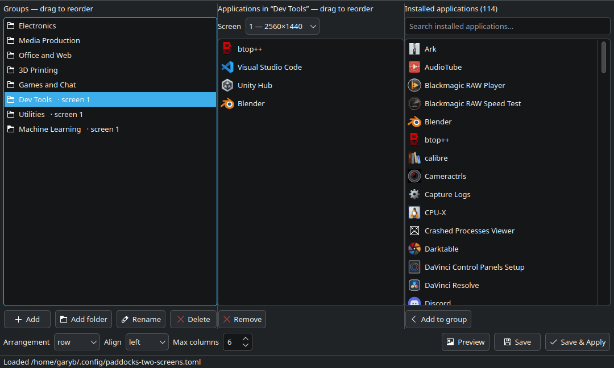

<!--
SPDX-FileCopyrightText: 2026 Gary Bissett <gary.bissett@gmail.com>

SPDX-License-Identifier: MIT
-->

<h1>
  <picture>
    <source media="(prefers-color-scheme: dark)" srcset="icons/paddocks-dark-64.png">
    
  </picture>
  Paddocks
</h1>

Grouped desktop launcher panels for KDE Plasma 6, built out of stock Plasma widgets.

Windows has several tools that group desktop icons into titled, translucent
panels; Linux has none. Plasma can already do most of it, but the pieces are
undocumented and several fail *silently*. Paddocks is the working setup, plus —
more usefully — the five things that otherwise cost an afternoon each.


## Install

```
pipx install "paddocks[gui] @ git+https://github.com/SonicP3L1C4N/paddocks.git"
paddocks install-desktop        # optional: menu entry and icon
```

Or clone and symlink the entry point onto your PATH — no installer, and edits
take effect immediately:

```
git clone https://github.com/SonicP3L1C4N/paddocks.git
ln -s "$PWD/paddocks/bin/paddocks" ~/.local/bin/paddocks
```

Requires KDE Plasma 6 (developed against 6.6), Python 3.11+ for `tomllib`, and
`qdbus6` / `kwriteconfig6` / `kquitapp6`, all standard on a Plasma install.
The command line has no third-party dependencies; only `paddocks edit` needs
PyQt6, which the `[gui]` extra pulls in. A distro package
(`sudo apt install python3-pyqt6`) works too, and is what a checkout uses — drop
the extra to avoid a second copy of Qt in a venv.

## Use

Each group becomes a titled Quicklaunch widget, positioned and sized
automatically from a small TOML file. Clicking launches; dragging an application
onto a group adds it.


```
paddocks discover > ~/.config/paddocks.toml   # every installed app, pre-grouped
$EDITOR ~/.config/paddocks.toml               # cut it down to what you use
paddocks apply --dry-run                      # check the computed layout
paddocks apply
```

`discover` buckets every installed `.desktop` file by its `Categories=` field —
roughly the grouping the application menu already shows — and annotates each id
with the application name, so it is a list to delete from rather than one to
write:

```toml
[[group]]
name = "Graphics"
apps = [
    "org.blender.Blender",   # Blender
    "org.inkscape.Inkscape", # Inkscape
    "org.kde.krita",         # Krita
]
```

### The editor

`paddocks edit` does the same job in a window: groups on the left, the selected
group's applications in the middle, everything installed on the right.



Drag within either list to reorder, drag a group up or down to change where it
lands on screen, double-click an application to add or remove it. **Preview**
shows the computed layout without touching anything; **Save & Apply** writes the
config and rebuilds the desktop. An id that no longer resolves is shown in red
and kept rather than quietly dropped — the application may only be temporarily
uninstalled.

Saving rewrites the file canonically: non-default settings, then the groups in
order. **Hand-written comments do not survive that.** Python has no
standard-library TOML writer, and the round-trip libraries that preserve
comments are a dependency nothing else here needs.

### App ids

Ids do not have to be the exact `.desktop` filename. The same application is
`firefox` from a distro package, `firefox_firefox` from a snap and
`org.mozilla.firefox` from a flatpak, so entries are also matched on the
reverse-DNS tail, the snap-style suffix and the launcher's `Name=`. Anything
inexact is reported so you can tighten the config, and a miss suggests the
nearest ids instead of just failing:

```
~~ matched by name: Office and Web/firefox -> firefox_firefox
!! not installed: Dev Tools/vscode  (did you mean: code, discord?)
```

### Commands

| | |
|---|---|
| `paddocks discover` | starter config from installed apps — `--desktop-only`, `--all` |
| `paddocks apply` | build the groups — `--dry-run`, `--strict`, `--no-strict` |
| `paddocks edit` | the editor window |
| `paddocks status` | what is currently set up |
| `paddocks remove` | take the groups away again |
| `paddocks translucency 0.4` | widget background opacity, lower is more transparent; `reset` to undo |
| `paddocks install-desktop` | menu entry and icon — `--remove`, `--variant dark\|light` |

`--strict` turns an unresolved launcher into an error that changes nothing —
for a settled config, or when driving `apply` from a script. Put
`strict = true` under `[settings]` for every run; `--no-strict` gets past it
once. It earns its keep on hand-written `.desktop` files, which stop resolving
the moment their target moves and drop the app quietly out of its group.

`install-desktop` writes `paddocks.desktop` into `~/.local/share/applications`
and the icon into `~/.local/share/icons/hicolor`. The entry is generated rather
than checked in, because `Exec=` has to carry the absolute path of wherever you
cloned this — move the clone and run it again.

## What it does and does not cover

| Capability | Status |
|---|---|
| Grouped, titled launcher panels | ✅ |
| Click to launch, drag to add | ✅ |
| Translucent backgrounds | ✅ see caveats |
| Arbitrary files and folders in a group | ❌ launchers only |
| Multiple desktop pages | ✅ use Plasma Activities (not managed here) |
| Roll-up / collapse a panel | ❌ no equivalent in Plasma |
| Double-click desktop to hide icons | ❌ no equivalent |
| Auto-sorting rules by file type | ❌ groups are declared, not inferred |

## The five things that cost an afternoon

None of this is documented, and most of it fails without an error message.

<details>
<summary><b>1. Folder View looks like the right widget, and is a dead end</b></summary>

The obvious build is a Folder View per group, pointed at a folder of `.desktop`
files. Both available URL schemes fail, in different ways:

* **`file:///home/you/Desktop/Apps`** — renders `org.kicad.pcbnew.desktop`
  instead of `PCB Editor`. The *icon* resolves correctly, so it reads as a
  labelling bug rather than a URL problem. Only the `desktop:/` KIO worker maps
  `.desktop` files to their `Name=`.
* **`desktop:/Apps`** — labels are correct, and it looks like the answer. But
  `kio_desktop` only implements part of the protocol for subpaths: listing works,
  **launching is a silent no-op**, and new files are never noticed.

That second one costs a day to trust and then unpick. Verified with
`kioclient exec`:

| URL passed to KIO | Result |
|---|---|
| `/home/you/Desktop/Apps/kcalc.desktop` | launches |
| `desktop:/Apps/kcalc.desktop` | exits 0, launches nothing |
| same, file made executable | exits 0, launches nothing |
| `desktop:/Apps` (listing) | works fine |

Launching only works at the desktop *root* — any grouping folder breaks it. So
the trade is correct labels or working launchers, never both.

**Use Quicklaunch instead.** `org.kde.plasma.quicklaunch` stores `file://` URLs
pointing straight at installed `.desktop` files, renders them by application
name, launches them, and accepts drag-and-drop.

Two non-obvious keys. `maxSectionCount` sets the icon row count — without it
Quicklaunch flows everything into one row and shrinks icons to fit, so icon size
varies between groups. And it *balances* icons across the rows it is given, so
six in two rows render 3+3, not 4+2: size the widget to that balanced column
count, or it scales the icons up to fill the extra width and every group comes
out slightly different.

</details>

<details>
<summary><b>2. Plasma's scripting API cannot position widgets</b></summary>

`desktop.addWidget()` works. Positioning it does not:

```js
widget.geometry = Qt.rect(40, 40, 520, 420);   // ReferenceError: Qt is not defined
widget.geometry = {x: 40, y: 40, ...};         // no error, no effect
```

The object-literal form is the nasty one — it silently does nothing, and reading
`widget.geometry` back reports the auto-placed position, so it looks like Plasma
overrode your value rather than ignoring it.

Positions live in `ItemGeometries-<W>x<H>` under `[Containments][<id>]` in
`~/.config/plasma-org.kde.plasma.desktop-appletsrc`, formatted
`Applet-<id>:x,y,w,h,0;`. **plasmashell rewrites that file when it exits**, so it
must be stopped before the write, not after:

```
kquitapp6 plasmashell
kwriteconfig6 --file plasma-org.kde.plasma.desktop-appletsrc \
  --group Containments --group 1 --key ItemGeometries-3440x1440 "Applet-28:60,50,560,336,0;"
plasmashell &
```

Also note `evaluateScript` only reliably returns `print()` output — a bare
trailing expression usually comes back empty.

</details>

<details>
<summary><b>3. <code>plasma-apply-desktoptheme</code> can be a silent no-op</b></summary>

On distros shipping `AutomaticLookAndFeel=true` in `kdeglobals` — Kubuntu among
them — the look-and-feel package re-asserts its own desktop theme. The command
reports success, `plasmarc` shows your theme, and Plasma renders something else.
The only signal is a cache mtime:

```
$ ls -la --time-style=+%H:%M:%S ~/.cache/plasma_theme_*.kcache
... 08:38:36 plasma_theme_MyCustomTheme.kcache      # applied here
... 08:40:15 plasma_theme_kubuntu-light.kcache      # still being used
```

Fix: don't introduce a new theme id at all. Copy the active theme into
`~/.local/share/plasma/desktoptheme/` **under its original name** — the user data
dir shadows `/usr/share` — and patch the copy. Do it for the light *and* dark
variants, or the styling vanishes when the day/night schedule flips.

</details>

<details>
<summary><b>4. Theme caches are keyed by theme name</b></summary>

Following from the above: keeping the name means the pixmap cache keeps serving
the old artwork. Clear it while plasmashell is down.

```
rm -f ~/.cache/plasma_theme_*.kcache ~/.cache/ksvg-elements
```

</details>

<details>
<summary><b>5. <code>widgets/background</code> is the applet frame; <code>translucent/</code> is dead</b></summary>

There is no opacity setting for widget backgrounds anywhere in Plasma. The frame
is a theme SVG, selected in `BasicAppletContainer.qml`:

```qml
if (effectiveBackgroundHints & TranslucentBackground) return "widgets/translucentbackground";
else if (effectiveBackgroundHints & StandardBackground) return "widgets/background";
```

Desktop widgets take the `StandardBackground` path.
`translucent/widgets/background.svgz` exists in every theme and is referenced by
nothing — patching it, the obvious first guess, changes nothing.

To make the frame transparent, add an `opacity` attribute to the nine `<g>`
elements `center`, `top`, `bottom`, `left`, `right` and the four corners.
Ancestor opacity is not applied when Qt renders an SVG by element id, so setting
it on the root `<svg>` does not work either. Leave the `shadow-*` elements alone
so panels still read against a busy wallpaper. Most distro themes are sparse and
fall back to `default` for artwork, so the file to copy and patch is usually
`/usr/share/plasma/desktoptheme/default/widgets/background.svgz`.

</details>

## Caveats

**Tested on one machine.** Plasma 6.6.6, Kubuntu 26.04, Wayland, a single
3440×1440 screen. Multi-monitor is unhandled — everything targets
`screenGeometry(0)` and the containment from `desktops()[0]`.

**This leans on private API.** `ItemGeometries` and the containment layout
internals are not a stable interface. A Plasma point release can change the
format; if panels land in the wrong place after an update, check that first.

**Groups hold application launchers, not files.** If you want a group of
documents or folders, that is Folder View's job, with the caveats in gotcha #1.

**`translucency` shadows system themes.** While the shadow copies exist, distro
updates to those themes stop reaching you. That is why it is a separate command
from the groups — skip it if the trade is not worth it.

**`apply` rewrites, it does not merge.** It removes the widgets it made last
time (tracked in `~/.local/state/paddocks/state.json`) and rebuilds from the
config. Hand-placed widgets are left alone, but not moved out of the way.
Launchers added by dragging live in that widget's config, so `apply` discards
them — add them to the TOML instead.

**Every `apply` backs up your desktop layout first.**
`plasma-org.kde.plasma.desktop-appletsrc` holds every panel, widget and
wallpaper setting you have, so it is copied into
`~/.local/state/paddocks/backups/` before `ItemGeometries` is touched; the last
five are kept. Restoring is a copy back, with plasmashell stopped for the same
reason the write needs it:

```
kquitapp6 plasmashell
cp ~/.local/state/paddocks/backups/plasma-org.kde.plasma.desktop-appletsrc.<stamp> \
   ~/.config/plasma-org.kde.plasma.desktop-appletsrc
plasmashell &
```

**Do not `resolve()` launcher paths.** Flatpak's `exports/share/applications` is
a symlink farm into content-addressed store paths. Following those symlinks bakes
a commit hash into the URL, and every flatpak launcher breaks on the next update
of that app. Use the export path as-is.

## Contributing

Reports from other distros are the most useful thing — particularly whether
`AutomaticLookAndFeel` behaves the same way, and whether the layout constants in
`paddocks/layout.py` hold at other icon sizes and scale factors.

```
python3 -m unittest discover -s tests -t .
```

Standard library only, nothing to install. The tests never touch your real
config, state file or a running plasmashell — the plasma module is replaced
wholesale rather than patched function by function, so a missed attribute
cannot take your desktop down. Editor tests skip themselves if PyQt6 is absent.

## Trademarks

Paddocks is an independent project, not affiliated with, endorsed by, or derived
from any commercial desktop-organiser product. Any such products are named only
for factual comparison, and remain the trademarks of their respective owners.

## License

MIT
