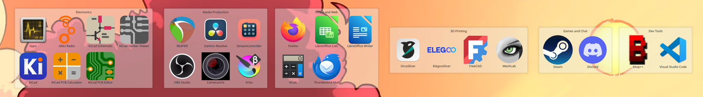
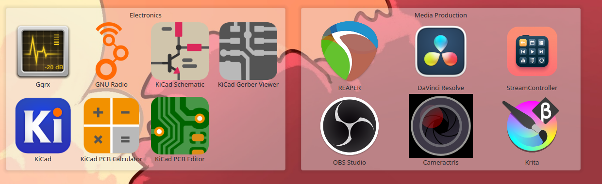

# Paddocks

Grouped desktop launcher panels for KDE Plasma 6, built out of stock Folder View widgets.

Windows has several tools that group desktop icons into titled, translucent
panels. Linux has none of them — the best known is Windows-only and will not run
under Wine, because it hooks the Windows shell directly. Plasma can already do
most of what those tools are used for, but the pieces are undocumented and
several of them fail *silently*.

Paddocks is the working setup, plus — more usefully — the five things that
otherwise cost an afternoon each.



## What you get

Each group becomes a titled Folder View widget on the desktop, positioned and
sized automatically from a small TOML file.

```toml
[[group]]
name = "Electronics"
apps = ["org.kicad.kicad", "org.kicad.pcbnew", "dk.gqrx.gqrx", "gnuradio-grc"]
```



Launchers are listed by application name rather than `.desktop` filename, each
group carries its own title, and the panel background is optionally translucent.

```
paddocks discover > ~/.config/paddocks.toml   # starting point from ~/Desktop
$EDITOR ~/.config/paddocks.toml               # split into groups
paddocks apply --dry-run                      # check the computed layout
paddocks apply
```

Optionally, more transparent widget backgrounds:

```
paddocks translucency 0.4      # lower = more transparent
paddocks translucency reset
```

Undo everything:

```
paddocks remove --delete-store
paddocks translucency reset
```

## Install

No packaging yet — clone and symlink the entry point onto your PATH.

```
git clone https://github.com/SonicP3L1C4N/paddocks.git
ln -s "$PWD/paddocks/bin/paddocks" ~/.local/bin/paddocks
```

Requires KDE Plasma 6 (developed against 6.6), Python 3.11+ for `tomllib`, and
`qdbus6` / `kwriteconfig6` / `kquitapp6`, all standard on a Plasma install.

## What it does and does not cover

| Capability | Status |
|---|---|
| Grouped, titled icon panels | ✅ |
| Live view of a folder | ✅ a group *is* a folder |
| Translucent backgrounds | ✅ see caveats |
| Multiple desktop pages | ✅ use Plasma Activities (not managed here) |
| Roll-up / collapse a panel | ❌ no equivalent in Plasma |
| Double-click desktop to hide icons | ❌ no equivalent |
| Auto-sorting rules by file type | ❌ groups are declared, not inferred |

## The five things that cost an afternoon

None of this is documented, and most of it fails without an error message.

### 1. `file://` makes every launcher show its filename

A Folder View pointed at `file:///home/you/Desktop/Apps` renders
`org.kicad.pcbnew.desktop`, not `PCB Editor`. The *icon* resolves correctly,
which makes it look like a labelling bug rather than a URL problem.

Only the `desktop:/` KIO worker maps `.desktop` files to their `Name=`. So the
URL must be `desktop:/Apps` — and because that worker maps the desktop folder and
nothing else, the launcher store has to live inside `~/Desktop`. Naming it
`.Paddocks` keeps it from showing up as a desktop icon.

Get it right and the labels read as applications, not filenames — see the
[close-up above](#what-you-get).

### 2. Plasma's scripting API cannot position widgets

`desktop.addWidget()` works. Positioning it does not:

```js
widget.geometry = Qt.rect(40, 40, 520, 420);   // ReferenceError: Qt is not defined
widget.geometry = {x: 40, y: 40, ...};         // no error, no effect
```

The object-literal form is the nasty one — it silently does nothing, and reading
`widget.geometry` back reports the auto-placed position, so it looks like Plasma
overrode your value rather than ignoring it.

Positions live in `ItemGeometries-<W>x<H>` under `[Containments][<id>]` in
`~/.config/plasma-org.kde.plasma.desktop-appletsrc`, formatted
`Applet-<id>:x,y,w,h,0;`. **plasmashell rewrites that file when it exits**, so it
must be stopped before the write, not after:

```
kquitapp6 plasmashell
kwriteconfig6 --file plasma-org.kde.plasma.desktop-appletsrc \
  --group Containments --group 1 --key ItemGeometries-3440x1440 "Applet-28:60,50,560,336,0;"
plasmashell &
```

Also note `evaluateScript` only reliably returns `print()` output — a bare
trailing expression usually comes back empty.

### 3. `plasma-apply-desktoptheme` can be a silent no-op

On distros shipping `AutomaticLookAndFeel=true` in `kdeglobals` — Kubuntu among
them — the look-and-feel package re-asserts its own desktop theme. The command
reports success, `plasmarc` shows your theme, and Plasma renders something else.

The only signal is a cache mtime:

```
$ ls -la --time-style=+%H:%M:%S ~/.cache/plasma_theme_*.kcache
... 08:38:36 plasma_theme_MyCustomTheme.kcache      # applied here
... 08:40:15 plasma_theme_kubuntu-light.kcache      # still being used
```

Fix: don't introduce a new theme id at all. Copy the active theme into
`~/.local/share/plasma/desktoptheme/` **under its original name** — the user data
dir shadows `/usr/share` — and patch the copy. Do it for the light *and* dark
variants, or the styling vanishes when the day/night schedule flips.

### 4. Theme caches are keyed by theme name

Following from the above: keeping the name means the pixmap cache keeps serving
the old artwork. Clear it while plasmashell is down.

```
rm -f ~/.cache/plasma_theme_*.kcache ~/.cache/ksvg-elements
```

### 5. `widgets/background` is the applet frame; `translucent/` is dead

There is no opacity setting for widget backgrounds anywhere in Plasma. The frame
is a theme SVG, selected in `BasicAppletContainer.qml`:

```qml
if (effectiveBackgroundHints & TranslucentBackground) return "widgets/translucentbackground";
else if (effectiveBackgroundHints & StandardBackground) return "widgets/background";
```

Desktop widgets take the `StandardBackground` path.
`translucent/widgets/background.svgz` exists in every theme and is referenced by
nothing — patching it, the obvious first guess, changes nothing.

To make the frame transparent, add an `opacity` attribute to the nine `<g>`
elements `center`, `top`, `bottom`, `left`, `right` and the four corners.
Ancestor opacity is not applied when Qt renders an SVG by element id, so setting
it on the root `<svg>` does not work either. Leave the `shadow-*` elements alone
so panels still read against a busy wallpaper.

Most distro themes are sparse — Kubuntu's are 20K of colours — and fall back to
`default` for artwork, so the file to copy and patch is usually
`/usr/share/plasma/desktoptheme/default/widgets/background.svgz`.

## Caveats

**Tested on one machine.** Plasma 6.6.6, Kubuntu 26.04, Wayland, a single
3440×1440 screen. Multi-monitor is unhandled — everything targets
`screenGeometry(0)` and the containment from `desktops()[0]`.

**This leans on private API.** `ItemGeometries` and the containment layout
internals are not a stable interface. A Plasma point release can change the
format; if panels land in the wrong place after an update, check that first.

**Folder View enforces a minimum size** of roughly 400×304. Groups of one or two
items come out larger than their contents need, and there is no way around it.

**`translucency` shadows system themes.** While the shadow copies exist, distro
updates to those themes stop reaching you. That is why it is a separate command
from the groups — skip it if the trade is not worth it. `translucency reset`
removes the copies.

**`apply` rewrites, it does not merge.** It removes the widgets it created
previously (tracked in `~/.local/state/paddocks/state.json`) and rebuilds from
the config. Widgets you placed by hand are left alone, but not moved out of the
way either.

## Contributing

Reports from other distros are the most useful thing — particularly whether
`AutomaticLookAndFeel` behaves the same way, and whether the layout constants in
`paddocks/layout.py` hold at other icon sizes and scale factors.

## Trademarks

Paddocks is an independent project, not affiliated with, endorsed by, or derived
from any commercial desktop-organiser product. Any such products are named only
for factual comparison, and remain the trademarks of their respective owners.

## License

MIT
