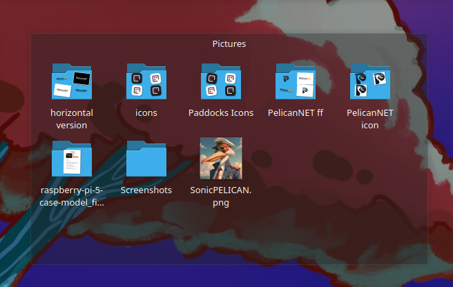
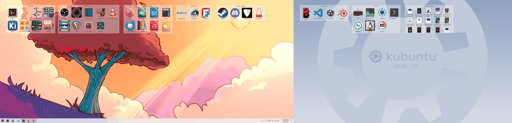
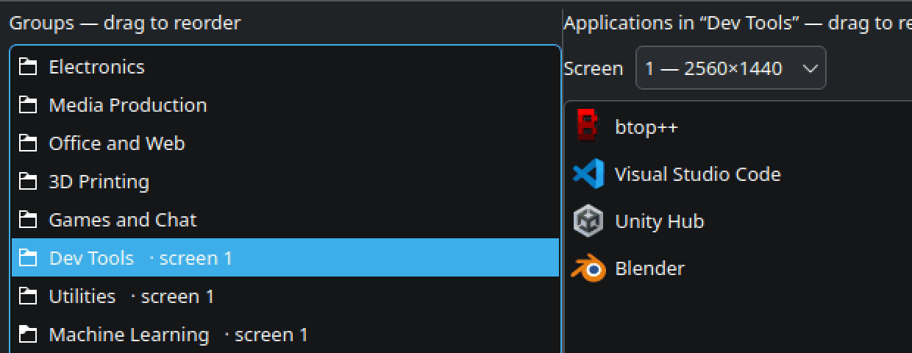

<!--
SPDX-FileCopyrightText: 2026 Gary Bissett <gary.bissett@gmail.com>

SPDX-License-Identifier: MIT
-->

<h1>
  <picture>
    <source media="(prefers-color-scheme: dark)" srcset="icons/paddocks-dark-64.png">
    
  </picture>
  Paddocks
</h1>

Grouped desktop launcher panels for KDE Plasma 6, built out of stock Plasma widgets.

Windows has several tools that group desktop icons into titled, translucent
panels; Linux has none. Plasma can already do most of it, but the pieces are
undocumented and several fail *silently*. Paddocks is the working setup, plus —
more usefully — the five things that otherwise cost an afternoon each.


**Tested on one machine** — Plasma 6.6.6, Kubuntu 26.04, Wayland. That is the
main thing to know before installing: it drives Plasma through its scripting
API, writes a private key in `plasma-org.kde.plasma.desktop-appletsrc`, and
restarts plasmashell to do it. `apply` copies that file aside before it touches
anything and `--dry-run` prints the layout without changing a thing, so a first
run is watchable rather than a leap. The [caveats](#caveats) are the full list.

## Install

```
pipx install "paddocks[gui] @ git+https://github.com/SonicP3L1C4N/paddocks.git"
paddocks install-desktop        # optional: menu entry and icon
```

Or clone and symlink the entry point onto your PATH — no installer, and edits
take effect immediately:

```
git clone https://github.com/SonicP3L1C4N/paddocks.git
ln -s "$PWD/paddocks/bin/paddocks" ~/.local/bin/paddocks
```

Requires KDE Plasma 6 (developed against 6.6), Python 3.11+ for `tomllib`, and
`qdbus6` / `kwriteconfig6` / `kquitapp6`, all standard on a Plasma install.
The command line has no third-party dependencies; only `paddocks edit` needs
PySide6, which the `[gui]` extra pulls in. A distro package
(`sudo apt install python3-pyside6.qtwidgets`) works too, and is what a checkout
uses — drop the extra to avoid a second copy of Qt in a venv. PySide6 is the LGPL
binding; PyQt6 is GPL-3.0-or-commercial, which does not suit an MIT project.

## Use

Each group becomes a titled Quicklaunch widget, positioned and sized
automatically from a small TOML file. Clicking launches; dragging an application
onto a group adds it.


```
paddocks discover > ~/.config/paddocks.toml   # every installed app, pre-grouped
$EDITOR ~/.config/paddocks.toml               # cut it down to what you use
paddocks apply --dry-run                      # check the computed layout
paddocks apply
```

`discover` buckets every installed `.desktop` file by its `Categories=` field —
roughly the grouping the application menu already shows — and annotates each id
with the application name, so it is a list to delete from rather than one to
write:

```toml
[[group]]
name = "Graphics"
apps = [
    "org.blender.Blender",   # Blender
    "org.inkscape.Inkscape", # Inkscape
    "org.kde.krita",         # Krita
]
```

### Folder groups

Give a group a `path` instead of `apps` and it shows that folder, live — drop a
file in and it appears on the desktop, with no `paddocks apply` in between.

```toml
[[group]]
name = "Pictures"
path = "~/Pictures"
```



`~` and `$VARS` are expanded, and a path that does not exist yet is a warning
rather than an error, so a folder on a drive you have not mounted fills in when
it turns up. A folder's contents change under you, so there is no count to size
it from: `cells = 12` sets how many icon slots to size the box for, defaulting
to 8, and the folder scrolls past that rather than growing.

**It is a window onto a folder, not a file browser.** Files open in their default
application and subfolders open in Dolphin — you cannot drill down inside the
widget. Folder View does have in-place navigation, with a back button, but it is
reachable only from a panel popup: `useListViewMode` is `isPopup && …`, and a
widget on the desktop is `Floating`, so the desktop always takes the other
branch and hands the URL to KIO.

A group is one thing or the other — setting both `apps` and `path` is an error
rather than a guess. Folder groups are Folder View widgets, which is the right
widget for files and the wrong one for launchers, for the reasons in gotcha #1.

### The editor

`paddocks edit` does the same job in a window: groups on the left, the selected
group's applications in the middle, everything installed on the right.


Drag within either list to reorder, drag a group up or down to change where it
lands on screen, double-click an application to add or remove it. **Add folder**
makes a folder group instead — pick a directory and it is stored with `~` intact
when it is under your home. Selecting one shows the folder it points at rather
than an app list, since Plasma reads its contents live. **Screen** is which
monitor the selected group is built on, listing what Plasma reports rather than
bare indexes — see below. **Preview**
shows the computed layout without touching anything; **Save & Apply** writes the
config and rebuilds the desktop. An id that no longer resolves is shown in red
and kept rather than quietly dropped — the application may only be temporarily
uninstalled.

Saving rewrites the file canonically: non-default settings, then the groups in
order. **Hand-written comments do not survive that.** Python has no
standard-library TOML writer, and the round-trip libraries that preserve
comments are a dependency nothing else here needs.

### Screens

Groups can be spread across monitors — five here on a 3440×1440 ultrawide, three
on a 2560×1440 beside it:



A group goes on Plasma's first screen unless it says otherwise:

```toml
[[group]]
name = "Dev Tools"
screen = 1
apps = ["code", "org.kde.konsole"]
```

The editor has the same choice as a picker on each group, which saves looking the
index up. Groups that are not on the first screen say so in the list, so you can
see where everything is without clicking through them:



The index is Plasma's own numbering, which follows neither the physical
arrangement nor which monitor you think of as primary — the picker spells out
each one's size for that reason. On the command line, ask:

```
$ paddocks screens
screen 0    3440x1440  containment 1
screen 1    2560x1440  containment 247
```

**A group configured for a monitor that is not plugged in keeps it** — in the
config, and in the editor, which shows it as *not connected* rather than
resetting it. Unplugging a monitor is not a decision to move what was on it, and
silently rewriting the group to screen 0 would make that decision permanent on
the next save.

Each screen is solved as its own layout against its own size, so groups wrap
where that screen runs out rather than where the widest one does, and the
coordinates start again from that screen's own top-left corner.

Underneath, this is three things that each fail silently if you get them wrong:

* **`desktops()` is not ordered by screen**, and holds one containment per screen
  *per activity* — only the ones on the current activity report a real `screen`.
  Indexing that list is how widgets end up on the wrong monitor. Match on the
  `screen` property instead.
* **`ItemGeometries` is keyed by resolution.** Positions for a 2560×1440 screen
  have to go under `ItemGeometries-2560x1440` in *that screen's* containment. A
  key naming any other size is not read at all — the widgets are created, and
  then sit wherever the shell auto-placed them.
* **Removing a widget means sweeping every containment.** A widget on the second
  monitor is not in the first containment's `widgetIds`, so looking only there
  reports it as removed without removing it.

### App ids

Ids do not have to be the exact `.desktop` filename. The same application is
`firefox` from a distro package, `firefox_firefox` from a snap and
`org.mozilla.firefox` from a flatpak, so entries are also matched on the
reverse-DNS tail, the snap-style suffix and the launcher's `Name=`. Anything
inexact is reported so you can tighten the config, and a miss suggests the
nearest ids instead of just failing:

```
~~ matched by name: Office and Web/firefox -> firefox_firefox
!! not installed: Dev Tools/vscode  (did you mean: code, discord?)
```

### Commands

| | |
|---|---|
| `paddocks discover` | starter config from installed apps — `--desktop-only`, `--all` |
| `paddocks apply` | build the groups — `--dry-run`, `--strict`, `--no-strict` |
| `paddocks edit` | the editor window |
| `paddocks status` | what is currently set up |
| `paddocks screens` | the screens Plasma reports, and their containments |
| `paddocks remove` | take the groups away again |
| `paddocks translucency 0.4` | widget background opacity, lower is more transparent; `reset` to undo |
| `paddocks install-desktop` | menu entry and icon — `--remove`, `--variant dark\|light` |

`--strict` turns an unresolved launcher into an error that changes nothing —
for a settled config, or when driving `apply` from a script. Put
`strict = true` under `[settings]` for every run; `--no-strict` gets past it
once. It earns its keep on hand-written `.desktop` files, which stop resolving
the moment their target moves and drop the app quietly out of its group.

`install-desktop` writes `paddocks.desktop` into `~/.local/share/applications`
and the icon into `~/.local/share/icons/hicolor`. The entry is generated rather
than checked in, because `Exec=` has to carry the absolute path of wherever you
cloned this — move the clone and run it again.

## What it does and does not cover

| Capability | Status |
|---|---|
| Grouped, titled launcher panels | ✅ |
| Click to launch, drag to add | ✅ |
| Translucent backgrounds | ✅ see caveats |
| A group showing a folder, live | ✅ `path = "~/Downloads"` |
| Files and launchers mixed in one group | ❌ a group is one or the other |
| Multiple desktop pages | ✅ use Plasma Activities (not managed here) |
| Roll-up / collapse a panel | ❌ no equivalent in Plasma |
| Double-click desktop to hide icons | ❌ no equivalent |
| Auto-sorting rules by file type | ❌ groups are declared, not inferred |

## The five things that cost an afternoon

None of this is documented, and most of it fails without an error message.

All five went to KDE as bug reports on 2026-08-14 (524242–524247, plus a comment
on 362511) and all but one had a reply within a day. **The outcomes are recorded
inline below, including the one where the report turned out to be wrong.**
`docs/plasma-bugs.md` is the full record.

<details>
<summary><b>1. Folder View looks like the right widget for launchers, and is a dead end</b></summary>

This is about **launchers**. For real files, Folder View is the right answer and
is what folder groups use — every failure below is specific to `.desktop` files.

The obvious build is a Folder View per group, pointed at a folder of `.desktop`
files. Both available URL schemes fail, in different ways:

* **`file:///home/you/Desktop/Apps`** — renders `org.kicad.pcbnew.desktop`
  instead of `PCB Editor`. The *icon* resolves correctly, so it reads as a
  labelling bug rather than a URL problem. Only the `desktop:/` KIO worker maps
  `.desktop` files to their `Name=`.
* **`desktop:/Apps`** — labels are correct, and it looks like the answer. But
  `kio_desktop` only implements part of the protocol for subpaths: listing works,
  **launching is a silent no-op**, and new files are never noticed.

That second one costs a day to trust and then unpick. Verified with
`kioclient exec`:

| URL passed to KIO | Result |
|---|---|
| `/home/you/Desktop/Apps/kcalc.desktop` | launches |
| `desktop:/Apps/kcalc.desktop` | exits 0, launches nothing |
| same, file made executable | exits 0, launches nothing |
| `desktop:/Apps` (listing) | works fine |

Launching only works at the desktop *root* — any grouping folder breaks it. So
the trade is correct labels or working launchers, never both.

**Upstream.** The `desktop:/` launch no-op is
[bug 524242](https://bugs.kde.org/show_bug.cgi?id=524242), **RESOLVED FIXED** —
it was already fixed in KIO by
[4901a6cc](https://invent.kde.org/frameworks/kio/-/commit/4901a6cc7129dcfc2fae23c8526db31dd811b486),
which was not backported to the 6.24 LTS branch because the fix needed a
substantive UI change. So it is fixed for you if you are on a rolling Frameworks
and not if you are on an LTS distro, which is most people reading this.

The `file://` labelling is [bug 524243](https://bugs.kde.org/show_bug.cgi?id=524243),
**WONTFIX, and intentional on both sides**: hiding `Name=` for `file://` entries
is deliberate, and one of the reasons `desktop:/` exists is to *not* do that, so
launchers on the desktop can be named properly. Inconsistent, and acknowledged as
such — "the alternative is to field a zillion complaints about ugly app launcher
names on the desktop". A trade-off, not an oversight.

**Use Quicklaunch instead.** `org.kde.plasma.quicklaunch` stores `file://` URLs
pointing straight at installed `.desktop` files, renders them by application
name, launches them, and accepts drag-and-drop.

Two non-obvious keys. `maxSectionCount` sets the icon row count — without it
Quicklaunch flows everything into one row and shrinks icons to fit, so icon size
varies between groups. And it *balances* icons across the rows it is given, so
six in two rows render 3+3, not 4+2: size the widget to that balanced column
count, or it scales the icons up to fill the extra width and every group comes
out slightly different.

</details>

<details>
<summary><b>2. Plasma's scripting API cannot position widgets</b></summary>

`desktop.addWidget()` works. Positioning it does not:

```js
widget.geometry = Qt.rect(40, 40, 520, 420);   // ReferenceError: Qt is not defined
widget.geometry = {x: 40, y: 40, ...};         // no error, no effect
```

The object-literal form is the nasty one — it silently does nothing, and reading
`widget.geometry` back reports the auto-placed position, so it looks like Plasma
overrode your value rather than ignoring it.

Positions live in `ItemGeometries-<W>x<H>` under `[Containments][<id>]` in
`~/.config/plasma-org.kde.plasma.desktop-appletsrc`, formatted
`Applet-<id>:x,y,w,h,0;`. **plasmashell rewrites that file when it exits**, so it
must be stopped before the write, not after:

```
kquitapp6 plasmashell
kwriteconfig6 --file plasma-org.kde.plasma.desktop-appletsrc \
  --group Containments --group 1 --key ItemGeometries-3440x1440 "Applet-28:60,50,560,336,0;"
plasmashell &
```

Also note `evaluateScript` only reliably returns `print()` output — a bare
trailing expression usually comes back empty. And **`print()` does not append a
newline**, so two calls come back glued into one string: printing `count=2` and
then `0: id=1` gives you `count=20: id=1`. Anything returning more than one value
has to emit its own separator; splitting on lines silently returns one record
made of all of them.

</details>

<details>
<summary><b>3. <code>plasma-apply-desktoptheme</code> can be a silent no-op</b></summary>

On distros shipping `AutomaticLookAndFeel=true` in `kdeglobals` — Kubuntu among
them — the look-and-feel package re-asserts its own desktop theme. The command
reports success, `plasmarc` shows your theme, and Plasma renders something else.
The only signal is a cache mtime:

```
$ ls -la --time-style=+%H:%M:%S ~/.cache/plasma_theme_*.kcache
... 08:38:36 plasma_theme_MyCustomTheme.kcache      # applied here
... 08:40:15 plasma_theme_kubuntu-light.kcache      # still being used
```

Fix: don't introduce a new theme id at all. Copy the active theme into
`~/.local/share/plasma/desktoptheme/` **under its original name** — the user data
dir shadows `/usr/share` — and patch the copy. Do it for the light *and* dark
variants, or the styling vanishes when the day/night schedule flips.

**Upstream.** [Bug 524244](https://bugs.kde.org/show_bug.cgi?id=524244),
**WONTFIX**: the tool did apply the theme, so exiting 0 is correct, and the later
reset is the automatic switcher doing the job you turned on. Fair as far as it
goes. It leaves the part that costs the time — `plasmarc` still says your theme,
so the obvious next diagnostic confirms the setting and sends you looking
anywhere but at the tool — but the report was made and answered, and it is not
worth arguing twice.

</details>

<details>
<summary><b>4. Theme caches, and what clearing them is actually for</b></summary>

```
rm -f ~/.cache/plasma_theme_*.kcache ~/.cache/ksvg-elements
```

This used to say the pixmap cache serves the old artwork forever when a theme is
edited under its own name, so clearing it is required. **That was wrong**, and it
was filed upstream as [bug 524245](https://bugs.kde.org/show_bug.cgi?id=524245)
before being tested properly. KSvg records a per-file `LastModified` in
`ksvg-elements` and rejects a cached entry whose file mtime differs — a changed
asset is picked up whether the shell was running at the time or not, and even if
the new file's timestamp is *older* than the cache's.

Two things are worth keeping from it. Testing this needs plasmashell **stopped**
while the file changes, or the running shell notices the edit itself and refreshes
the caches, and the restart afterwards proves nothing. And the mtimes have
one-second resolution, so a tool that writes a theme file and restarts the shell
in the same breath — which is what `paddocks translucency` does — clears the
caches anyway, as insurance rather than as a workaround.

</details>

<details>
<summary><b>5. A theme has two applet backgrounds, and the second one is invisible</b></summary>

There is no opacity setting for widget backgrounds anywhere in Plasma. The frame
is a theme SVG, selected in `BasicAppletContainer.qml`:

```qml
if (effectiveBackgroundHints & TranslucentBackground) return "widgets/translucentbackground";
else if (effectiveBackgroundHints & StandardBackground) return "widgets/background";
```

Desktop widgets take the `StandardBackground` path. To make that frame
transparent, add an `opacity` attribute to the nine `<g>` elements `center`,
`top`, `bottom`, `left`, `right` and the four corners. Ancestor opacity is not
applied when Qt renders an SVG by element id, so setting it on the root `<svg>`
does nothing. Leave the `shadow-*` elements alone so groups still read against a
busy wallpaper.

**And patch `translucent/widgets/background.svgz` as well as
`widgets/background.svgz`.** This is the part that is genuinely hidden. Themes
ship both, nothing references the second by name, and which one you get is
decided at runtime:

* `ThemePrivate::updateKSvgSelectors()` in libplasma sets the KSvg *selector*
  `translucent` whenever compositing and the blur effect are both active, and
  `opaque` when compositing is off.
* `ImageSetPrivate::findInImageSet()` in KSvg then resolves
  `<theme>/<selector>/<image>` **ahead of** `<theme>/<image>`, and does that
  within a theme before falling through to the fallback theme.

So on a normal blurred Wayland desktop, `translucent/widgets/background.svgz` is
the file actually being drawn. It is not a copy of the plain one: it is less
opaque and carries nine `blurred-mask-*` elements, which are what tell KWin the
region to blur behind the widget. Shadow only the plain asset and you get your
opacity *and* silently lose the blur, with nothing to indicate why.

There is a second trap inside that one. Because the selector search finishes the
current theme before moving on, a sparse theme that overrides only
`widgets/background.svgz` — which is what Kubuntu's own theme does — beats
Breeze's translucent variant outright. Patch a file in the *fallback* theme and
nothing happens at all, because the resolved path never reaches it.

**This one was reported wrong.** [Bug 524246](https://bugs.kde.org/show_bug.cgi?id=524246)
claimed `translucent/widgets/background.svgz` was referenced by nothing, on the
evidence that patching it changed nothing. It was CONFIRMED upstream, with an
invitation to submit a merge request deleting the files. The invitation is what
made it worth checking properly: dropping an obviously-wrong magenta background
into the *active* theme's `translucent/` directory turned every widget frame
magenta immediately. The original test had patched a file that was never on the
resolved path. Retracting it is in `docs/plasma-bugs.md`.

</details>

## Caveats

**Tested on one machine.** Plasma 6.6.6, Kubuntu 26.04, Wayland, a single
3440×1440 screen.

**Multi-monitor works, and screen indexes are Plasma's.** `screen = 1` on a
group puts it on Plasma's second screen, which is not necessarily the one on the
right — run `paddocks screens` and use the index it prints. Each screen is laid
out against its own size and written under its own containment, so a group never
has to know where its monitor sits in the combined desktop.

**This leans on private API.** `ItemGeometries` and the containment layout
internals are not a stable interface. A Plasma point release can change the
format; if panels land in the wrong place after an update, check that first.

**A group is launchers or a folder, not both.** Mixing them in one widget is
not something Plasma offers — Quicklaunch holds launcher URLs, Folder View
shows a directory. Use two groups.

**`translucency` shadows system themes.** While the shadow copies exist, distro
updates to those themes stop reaching you. That is why it is a separate command
from the groups — skip it if the trade is not worth it. It patches both applet
background variants (`widgets/background` and `translucent/widgets/background`),
because patching only the first turns the blur behind your widgets off without
saying so — see finding 5.

**`apply` rewrites, it does not merge.** It removes the widgets it made last
time (tracked in `~/.local/state/paddocks/state.json`) and rebuilds from the
config. Hand-placed widgets are left alone, but not moved out of the way.
Launchers added by dragging live in that widget's config, so `apply` discards
them — add them to the TOML instead.

**Every `apply` backs up your desktop layout first.**
`plasma-org.kde.plasma.desktop-appletsrc` holds every panel, widget and
wallpaper setting you have, so it is copied into
`~/.local/state/paddocks/backups/` before `ItemGeometries` is touched; the last
five are kept. Restoring is a copy back, with plasmashell stopped for the same
reason the write needs it:

```
kquitapp6 plasmashell
cp ~/.local/state/paddocks/backups/plasma-org.kde.plasma.desktop-appletsrc.<stamp> \
   ~/.config/plasma-org.kde.plasma.desktop-appletsrc
plasmashell &
```

**Do not `resolve()` launcher paths.** Flatpak's `exports/share/applications` is
a symlink farm into content-addressed store paths. Following those symlinks bakes
a commit hash into the URL, and every flatpak launcher breaks on the next update
of that app. Use the export path as-is.

## Contributing

Reports from other distros are the most useful thing — particularly whether
`AutomaticLookAndFeel` behaves the same way, and whether the layout constants in
`paddocks/layout.py` hold at other icon sizes and scale factors.

```
python3 -m unittest discover -s tests -t .
```

Standard library only, nothing to install. The tests never touch your real
config, state file or a running plasmashell — the plasma module is replaced
wholesale rather than patched function by function, so a missed attribute
cannot take your desktop down. Editor tests skip themselves if PySide6 is absent.

## Trademarks

Paddocks is an independent project, not affiliated with, endorsed by, or derived
from any commercial desktop-organiser product. Any such products are named only
for factual comparison, and remain the trademarks of their respective owners.

## License

MIT
